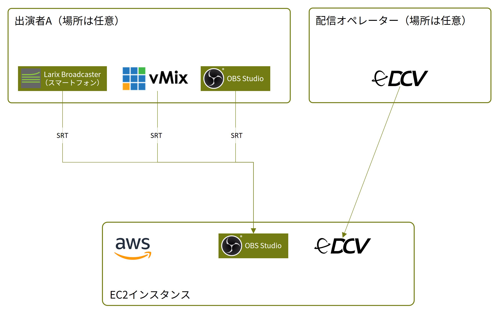

## 0. 前提

本レシピでは、AWS EC2 上に AMD GPU 搭載の Windows インスタンスを作成して、その上に OBS Studio をインストールし、
クラウド上にリモート配信環境を構築します。

映像ソースは、SRT を使用してクラウドへ送ることとします。

また、[NICE DCV](https://aws.amazon.com/jp/hpc/dcv/) を使うことで、
配信オペレーションにも耐えうる、低負荷かつ低遅延なリモートデスクトップ環境を実現します。

クラウドないし AWS に関する一般的な知識を有していることを前提とするので、解説は省きます。

AWS EC2 には NVIDIA GPU 搭載のインスタンスもあるのですが、
OBS Studio だけ起動するなら AMD GPU のインスタンスタイプがコスパに優れています。

以下は ap-northeast-1 (東京) での価格表です。us-east-1 (米国東部) ならもっと安いです。

| インスタンスタイプ   | GPU                     | OS      | オンデマンド時間単価(USD/時) |
|-------------|-------------------------|---------|-------------------|
| g4dn.xlarge | 1 (NVIDIA T4)           | Windows | 0.894             |
| g4ad.xlarge | 1 (AMD RADEON PRO V520) | Windows | **0.69482**       |

> Linux インスタンスの場合は更にコスパがよくなりますが、セットアップの難易度が上がるため今回は Windows インスタンスとしています。

> vMix を使用するならハードウェアエンコーダー (NVENC) が使える NVIDIA GPU のインスタンスタイプが推奨されます。
> これは vMix が AMD GPU のハードウェアエンコーダーに対応していないためです。

[Amazon EC2 G4 インスタンス詳細](https://aws.amazon.com/jp/ec2/instance-types/g4/)

## 1. 用意する物

### 1.1. スタジオ側

- 有効な AWS アカウント (EC2 にアクセス可能な権限が必要)

### 1.2. 出演者側

- SRT 送信可能な配信ソフト (OBS Studio, Larix Broadcaster, vMix 等)

### 1.3. 配信オペレーター側

- ウェブブラウザが快適に動作する Windows PC (dGPU 無しのノートPCでも可)

> Linux OS、Mac でも可能ですが本レシピでは Windows を前提とします

## 2. システム図



## 3. AWS EC2 に配信インスタンスを構築する

### 3.1. クオータの引き上げ

[参考ページ](https://docs.aws.amazon.com/ja_jp/servicequotas/latest/userguide/request-quota-increase.html)

AWS EC2 で GPU インスタンスを使用するためには、一般的には GPU インスタンスのクオータ引き上げをリクエストする必要があります。
（GPU 資源は数量が限られるため、用途・使用状況を確認してクオータを引き上げている様です。
筆者が実施した時の話なので今は状況が変わっている場合があります）

クオータはリージョン毎に設定されているため、
特定のリージョンで GPU インスタンスを使用する場合はそのリージョンのクオータを引き上げる必要があります。

1. AWS マネジメントコンソールにログインし、画面右上のプルダウンメニューでリージョンを選択 (例: `ap-northeast-1`)
2. サービス → Service Quotas に移動
3. 左メニューの「AWS サービス」で `Amazon Elastic Compute Cloud (Amazon EC2)` を選択
4. `Running On-Demand G and VT instances` を検索
5. 「適用されたアカウントレベルのクオータ値」を確認し、`0` の場合はクオータの引き上げが必要です。以下の手順に進んでください。
6. リストに表示された「クオータの名称」をクリック。
7. 「アカウントレベルでの引き上げをリクエスト」をクリック
8. 「クォータ値を引き上げる」に**必要な vCPU 数**を入力。
   GPU インスタンス最小の `xlarge` で vCPU が 4 つ搭載になるので、4 の倍数で入力してください (例: `4`, `8`, `12`, `16`, ...)
9. 「リクエスト」をクリック

実際にクオータが引き上げられるまでには時間がかかる場合があります。

リクエストの過程で不明な点があれば、 AWS サポートセンターに問い合わせてください。

### 3.2. IAM ロール作成

次に、EC2 インスタンスに割り当てる IAM ロールを準備します。

ロールには、後の手順で必要となる NICE DCV ライセンス取得と、AMD GPU Windows ドライバーのダウンロード用のポリシーが必要となります。

IAM ロールは一度作成したら複数のインスタンスで使いまわすことが可能です。

#### ポリシーの作成

1. AWS マネジメントコンソールにログインする
2. サービス → IAM に移動する
3. 左メニューの「ポリシー」をクリック
4. 「ポリシーの作成」をクリック
5. JSON タブをクリックして、以下の JSON を貼り付ける

   ```json
   {
     "Version": "2012-10-17",
     "Statement": [
       {
         "Effect": "Allow",
         "Action": "s3:GetObject",
         "Resource": [
           "arn:aws:s3:::dcv-license.ap-northeast-1/*"
         ]
       }
     ]
   }
   ```
6. 「次へ」をクリック
7. 「ポリシー名」にお好みの名前 (例:`My-DCVLicenseAccess-Policy`) を入力して、「ポリシーの作成」をクリック

#### ロールの作成

1. 左メニューの「ロール」をクリック
2. 「ロールを作成」をクリック
3. 信頼されたエンティティの種類: `AWS サービス` を選択
4. ユースケース: プルダウンで `EC2` を選択して、一番上の `EC2` にチェックを入れる
5. 「次へ」をクリック
6. 検索欄で作成したポリシーの名前 (例:`My-DCVLicenseAccess-Policy`) を入力して検索し、リストでチェックを入れる
7. 検索欄で `AmazonS3ReadOnlyAccess` を入力して検索し、リストでチェックを入れる
8. 「次へ」をクリック
9. 「ロール名」にお好みの名前 (例:`My-EC2-Role`) を入力して、「ロールを作成」をクリック

### 3.3. セキュリティグループ作成

外部からのアクセスを許可する為に、必要なポートが解放されるセキュリティグループを作成します。

セキュリティグループも一度作成したら複数のインスタンスで使いまわすことが可能です。

> ここでは RDP (初期設定に必要)、NICE DCV (リモートデスクトップ)、SRT (ビデオストリーミング) のためのセキュリティグループを作成します。

1. サービス → EC2 に移動する
2. 左メニューの「セキュリティグループ」をクリック
3. 「セキュリティグループを作成」をクリック
4. 「セキュリティグループ名」にお好みの名前 (例:`My-EC2-OBS-SG`) を入力
5. 「説明」に適当な説明 (例:`RDP / NICE DCV / SRT`) を入力
6. 「VPC」でデフォルトのVPCを選択
7. 「インバウンドルール」の「ルールを追加」をクリックして以下のルールを追加

   | タイプ     | プロトコル | ポート範囲       | ソース           | 説明(任意)                |
      |---------|-------|-------------|---------------|-----------------------|
   | RDP     | TCP   | 3389        | Anywhere-IPv4 | 例:`RDP(Remove later)` |
   | カスタムUDP | UDP   | 8443        | Anywhere-IPv4 | 例:`NICE DCV`          |
   | カスタムTCP | TCP   | 8443        | Anywhere-IPv4 | 例:`NICE DCV`          |
   | カスタムUDP | UDP   | 20001-20010 | Anywhere-IPv4 | 例:`SRT`               |

   > ご注意：説明を単純にするため全ての IP からの接続を許可しています。より安全にするためには特定のIPからの接続のみに制限してください。

8. 「アウトバウンドルール」はデフォルトのままとする
9. 「セキュリティグループを作成」をクリック

### 3.4. EC2 でインスタンスを作成

1. サービス → EC2 に移動する
2. 「インスタンスを起動」をクリックする
3. ウィザードを使用して以下の様に設定する

    - 名前: お好みの名前を付けてください (例:`OBS Studio server`)
    - Amazon マシンイメージ: クイックスタート → Windows → `Microsoft Windows Server 2022 Base` を選択
    - インスタンスタイプ: `g4ad.xlarge` (AMD GPU搭載) を選択
    - キーペア: 「新しいキーペアの作成」で作成して使用
        - キーペア名: お好みの名前を付けてください (例:`My-EC2-Key`)
        - キーペアのタイプ: 「RSA」を選択
        - プライベートキーファイル形式: 「.pem」を選択。キーペア作成後、ダウンロードフォルダにファイルがダウンロードされます。
    - ネットワーク設定:
        - セキュリティグループ: 「既存のセキュリティグループを選択する」を選択し、作成したセキュリティグループ (例:`My-EC2-OBS-SG`) を選択
    - ストレージ: 50 GB (最低限の容量。必要に応じて増やしてください) gp3 または gp2
    - 高度な設定
        - IAM インスタンスプロフィール:　作成したロール (例:`My-EC2-Role`) を選択
        - ユーザーデータ:
          ```
          <powershell>
            # 毎起動時にインスタンスストアをフォーマットして利用可能にします
            Get-Disk | `
              Where-Object -FilterScript {($_.FriendlyName -Eq "NVMe Amazon EC2 NVMe") `
              -And ($_.PartitionStyle -Eq "RAW")} | `
              Initialize-Disk -PartitionStyle GPT -PassThru -confirm:$false | `
              New-Partition -UseMaximumSize -AssignDriveLetter | `
              Format-Volume -NewFileSystemLabel "Instance Store" -FileSystem NTFS -Force -confirm:$false
   
            if (!(Test-Path "D:\OBSRecord")) {
              New-Item D:\OBSRecord -type Directory
            }
          </powershell>
          <persist>true</persist>
          ```
4. 「インスタンスを起動」をクリック
5. Windows インスタンスは初期化に時間がかかるため、暫く (5分～10分程度) 待ってから リモートデスクトップで接続してください。

#### Elastic IP (固定IP) の割り当て

SRT で外部から接続を受け付けるため、インスタンスに固定 IP を割り当てると便利です。
そうしないと、インスタンスを開始するたびにアドレスが変わってしまいます。

1. サービス → EC2 に移動する
2. 左メニューから「Elastic IP」をクリック
3. 「Elastic IP アドレスを割り当てる」をクリック
4. 「パブリック IPv4 アドレスプール」が `Amazon の IPv4 アドレスプール`、
   「ネットワークボーダーグループ」が `ap-northeast-1` になっていることを確認し「割り当て」をクリック
5. 割り当てられた IP アドレスをリストから右クリックし、コンテキストメニューから「Elastic IP アドレスの関連付け」をクリック
6. 「リソースタイプ」は `インスタンス` を選択
7. 「インスタンス」で先ほど作成したインスタンスを選択
8. 「関連付ける」をクリック

> Elastic IP はインスタンスが開始されていなくても課金されます (1 時間あたり 0.005 USD)

### 3.5. リモートデスクトップ接続 (RDP) でインスタンスに接続

> 最終的には NICE DCV に移行しますが、初期設定はリモートデスクトップ (RDP) で行います。

1. 左メニューの「インスタンス」をクリック
2. 先ほど起動したインスタンス (例:`OBS Studio server`) を検索して選択
3. 「インスタンスの概要」から「パブリック IPv4 DNS」をコピー
4. お手元の Windows PC でスタートメニュー → 「Windows アクセサリ」 → 「リモートデスクトップ接続」を起動し、
   「コンピューター」に先ほどコピーした「パブリック IPv4 DNS」を入力して「接続」をクリック
5. 「このリモート接続を信頼しますか？」と聞かれるので「接続」をクリック
6. 「資格情報を入力してください」が表示されるので、
    - ユーザー名: `Administrator`
    - パスワード: 以下の手順でパスワードを入手
        1. AWS マネジメントコンソールに戻ってインスタンスを右クリックし、
           コンテキストメニューから「セキュリティ」→「Windows パスワードを取得」をクリック
        2. 「プライベートキーファイルのアップロード」をクリックして、
           インスタンス時に作成したプライベートキーファイル (ダウンロードフォルダにダウンロードされている `.pem` ファイル) を選択しアップロード
        3. 「パスワードを復号化」をクリックして、表示されたパスワードをコピーしてリモートデスクトップのパスワードに張り付け
7. 「このリモートコンピューターのIDを識別できません。接続しますか？」と聞かれるので「はい」をクリック

### 3.6. AMD GPU ドライバーインストール

[参考ページ](https://docs.aws.amazon.com/AWSEC2/latest/UserGuide/install-amd-driver.html)

1. リモートデスクトップ接続でインスタンスに接続する
2. スタートメニューを右クリックし「Windows PowerShell」を起動
3. 以下のスクリプトを PowerShell にペーストして実行

   ```powershell
   $Bucket = "ec2-amd-windows-drivers"
   $KeyPrefix = "latest"
   $LocalPath = "$home\Desktop\AMD"
   $Objects = Get-S3Object -BucketName $Bucket -KeyPrefix $KeyPrefix -Region us-east-1
   foreach ($Object in $Objects) {
   $LocalFileName = $Object.Key
   if ($LocalFileName -like "*/AMD_GPU_WINDOWS_2K22_*" -and $Object.Size -ne 0) {
   $LocalFilePath = Join-Path $LocalPath $LocalFileName
   Copy-S3Object -BucketName $Bucket -Key $Object.Key -LocalFile $LocalFilePath -Region us-east-1
   }
   }
   
   ```

   スクリプトを最後まで実行すると、デスクトップに `AMD` フォルダが作成され、ドライバーがダウンロードされます
4. 以下のスクリプトを PowerShell にペーストして実行

   ```powershell
   Expand-Archive $LocalFilePath -DestinationPath "$home\Desktop\AMD\$KeyPrefix" -Verbose
   ```

   ドライバが解凍されます。

5. 以下のスクリプトを PowerShell にペーストして実行

   ```powershell
   pnputil /add-driver $home\Desktop\AMD\$KeyPrefix\*.inf /install /subdirs
   ```

   ドライバのインストールが実行されます。

6. インストールが完了したら、Windows インスタンスを再起動してください。
7. 再起動後、デバイスマネージャーで `AMD Radeon Pro V520` が表示されていることを確認してください。
   デスクトップの `AMD` フォルダは削除しても構いません。

### 3.7. NICE DCV インストール

[参考ページ](https://docs.aws.amazon.com/dcv/latest/adminguide/setting-up-installing-wininstall.html)

1. リモートデスクトップ接続でインスタンスに接続する
2. ブラウザで [NICE DCV Server インストーラー Windows (x86_64)](https://download.nice-dcv.com/) をダウンロード
3. インストーラーを実行してインストール
    - 「Components Selection」で `USB Driver` を有効にする
    - 「DCV Service Configuration」では、全てのチェックボックスを「チェック無し」とする
    - 「DCV Session Management Configuration」では、チェックボックスを「チェック無し」とし、ユーザーは `Administrator` のままとする。
4. タスクバーの検索窓に `regedit` と入力してエンターを押し、レジストリエディタを起動
   以下のキーに値をそれぞれ作成してください。
    - `Computer\HKEY_USERS\S-1-5-18\Software\GSettings\com\nicesoftware\dcv\connectivity`
        - `enable-quic-frontend`: `1` (DWORD (32-bit) Value)
        - `idle-timeout`: `0` (DWORD (32-bit) Value)
    - `Computer\HKEY_USERS\S-1-5-18\Software\GSettings\com\nicesoftware\dcv\session-management\automatic-console-session`
        - `storage-root`: `%home%/Documents/` (String Value)
5. インスタンスを再起動してください。
6. 以降は NICE DCV で接続します。お手元の PC に [NICE DCV Client](https://download.nice-dcv.com/) をインストールしてください。
7. NICE DCV Client を起動し、インスタンスの「パブリック IPv4 DNS」を入力して接続してください (「インスタンスの概要」→「パブリック IPv4 DNS」)
8. 「Your connection is not secure」と表示されるので「Trust and Connect」をクリック
9. 「Username」には `Administrator`、パスワードはリモートデスクトップ接続で使用したものと同じです。

### 3.8. Windows 日本語化

[参考ページ](https://www.dell.com/support/kbdoc/ja-jp/000111205/windows-server-2019-%E3%83%AD%E3%83%BC%E3%82%AB%E3%83%A9%E3%82%A4%E3%82%BA-%E6%89%8B%E9%A0%86)

Windows Server 2022 はデフォルトで英語環境なので、日本語化したい場合は以下の手順に従ってください。
英語環境のままで良い場合はこの手順をスキップできます。

1. スタートメニュー → 「歯車アイコン」をクリックして「設定」を開く
2. 「Time & Language」をクリック
3. 左メニューで「Language」をクリック
4. 「Add a language」をクリック
5. `Japanese` を検索して選択
6. 「Next」をクリック
7. 「Install language features」では全てのチェックボックスにチェックを入れる
8. 「Install」をクリック
9. ダウンロード＆インストールにしばらく時間がかかります
10. インストールが完了すると、サインアウトを促されるので、「Yes, sign out now」をクリックし、再度サインインしてください。

    > ログイン画面ではパスワードのペーストができないので、NICE DCV Client を切断して再接続するのがよいでしょう。

11. スタートメニュー → 「歯車アイコン」をクリックして「設定」を開く
12. 「時刻と言語」をクリック
13. 左メニューで「日付と時刻」をクリック
14. 「タイムゾーン」を `(UTC+09:00) 大阪、札幌、東京` に変更
15. 左メニューで「地域」をクリック
16. 「国または地域」を `日本` に変更
17. 「日付、時刻、地域の追加設定」をクリック
18. 「時計と地域」で「地域」をクリック
19. 「地域」で「管理」タブを開き「設定のコピー」をクリック
20. 「現在の設定のコピー先」で全てのチェックボックスにチェックを入れる
21. 「OK」をクリック
22. 再起動を促されますが「後日」をクリック
23. 「システムロケールの変更」をクリック
24. 「現在のシステムロケール」を `日本語 (日本)` に変更
25. 「OK」をクリック
26. 再び再起動を促されるので「今すぐ再起動」をクリックしてインスタンスを再起動してください

### 3.9. OBS Studio インストール

[OBS Studio 公式サイト](https://obsproject.com/) でインストーラーをダウンロードしてインストールしてください。

インストールしたらとりあえず起動するかテストしましょう。
デスクトップに作成された OBS Studio のショートカットをダブルクリックして起動してください。

### 3.9. ファイヤーウォールの設定

デフォルトで OBS Studio への外部からのコネクションはブロックされているので、
以下の手順で Windows Defender ファイヤーウォールを設定してください。

1. スタートメニュー →「Windows 管理ツール」→「セキュリティが強化された Windows Defender ファイアウォール」を起動
2. 左ツリー →「受信の規則」を選択
3. 「操作」→「新しい規則」をクリック
4. 「どの種類の規則を作成しますか？」では `プログラム` を選択
5. 「次へ」をクリック
6. `このプログラムのパス` を選択し `%ProgramFiles%\obs-studio\bin\64bit\obs64.exe` を入力
7. 「次へ」をクリック
8. `接続を許可する` を選択
9. 「次へ」をクリック
10. 「この規則はいつ適用しますか？」では全てのチェックボックスにチェックを入れる
11. 「次へ」をクリック
12. 「名前」に適当な名前 (例:`obs-studio`) を入力する
13. 「完了」をクリック

### 3.10. ユーザーの追加

Administrator のままでも使えますが、ユーザーを追加しておくとセキュリティ上のリスクを軽減できます。

1. スタートメニュー →「管理ツール」→「コンピューターの管理」を起動
2. 右のツリーから「システムツール」→「ローカルユーザーとグループ」→「ユーザー」を選択
3. リストで右クリックし、コンテキストメニューから「新しいユーザー」をクリック
4. 「ユーザー名」と「パスワード」「パスワードの確認入力」を入力
5. チェックボックスは全て外してください。
6. 「作成」をクリック
7. 「閉じる」をクリック

#### NICE DCV のセッション所有者を変更

NICE DCV のインストール時にセッション所有者を Administrator に設定しているため、このままだと追加したユーザーで接続できません。
以下の手順でセッション所有者を追加したユーザーに変更してください。

1. タスクバーの検索窓に `regedit` と入力してエンターを押し、レジストリエディタを起動
2. `コンピューター\HKEY_USERS\S-1-5-18\Software\GSettings\com\nicesoftware\dcv\session-management\automatic-console-session` に移動
3. `owner` の値を `Administrator` から追加したユーザー名に変更
4. レジストリエディタを閉じてインスタンスを再起動してください
5. 再起動後、再び NICE DCV Client を起動し、追加したユーザーでログインしてください。

> 以降、Administrator では NICE DCV に接続出来なくなります。
> 設定に失敗した場合は、リモートデスクトップ接続で Administrator にログインしてレジストリを修正してください。

> ユーザーでログインした場合、再起動・停止の方法が変わります
>
> スタートメニューからの再起動・シャットダウンは無効化されているので、
>
> 1. NICE DCV の右上のプルダウンメニューから「Ctrl + Alt + Del」をクリック
> 2. 「サインアウト」をクリック
> 3. 再びNICE DCV の右上のプルダウンメニューから「Ctrl + Alt + Del」をクリック
> 4. 画面右下の「電源ボタン」をクリック
> 5. 「シャットダウン」または「再起動」をクリック
> 6. `その他 (計画外)` を選択
> 7. 「続行」をクリック

## 4. OBS Studio の設定

ここでは、SRT を使用して入力を受け付け、AMD GPU のハードウェアエンコーダーを使用してフルHDで配信する設定を行います。

### 4.1. マイクとカメラの有効化

デフォルトでは、プライバシー設定でマイクとカメラが無効化されているので、以下の手順で有効化してください。

> この設定はしなくても使用可能ですが、NICE DCV のリモートマイク・ウェブカメラ機能が使えるので、設定しておくのがお勧めです。

1. スタートメニュー →「歯車アイコン」をクリック
2. 左メニューで「カメラ」をクリック
3. 「アプリがカメラにアクセスできるようにする」をオンにする
4. 左メニューで「マイク」をクリック
5. 「アプリがマイクにアクセスできるようにする」をオンにする

### 4.2. 配信の設定

1. OBS Studio を起動
2. 「設定」をクリック
3. 左メニューで「出力」をクリック
4. 以下の様に設定
    - 配信
        - 出力モード: `基本` のまま
        - 映像ビットレート: 1080 30p の場合は `5000 Kbps`、1080 60p の場合は `10000 Kbps` を目安とする (コンテンツによって推奨は異なる)
        - 音声ビットレート: `160` のまま
        - 映像エンコーダ: `ハードウェア(AMD, H.264)`
        - エンコーダプリセット: `Balanced` のまま
        - カスタムエンコーダ設定を有効にする: チェック無しのまま
        - 音声エンコーダ: `AAC (規定値)` のまま
    - 録画
        - 録画ファイルのパス: `D:` ドライブ以下のフォルダに変更 (理由と注意点は後述)
        - スペースなしのファイル名を生成する: チェック有り無しどちらでも可
        - 録画品質: `配信と同じ` のまま
        - 録画フォーマット: `Matroska Video (.mkv)` がおすすめ
5. 「適用」をクリック
6. 左メニューで「映像」をクリック
7. 以下の様に設定
    - 基本(キャンバス)解像度: `1920x1080`
    - 出力(スケーリング)解像度: `1920x1080`
    - FPS共通値: `30` または `60`
8. 「適用」をクリック
9. 左メニューで「配信」をクリック
10. 「サービス」で目的の配信先を選択して、アカウント接続やストリームキー設定を行ってください。
11. 「OK」をクリック

### 4.3. SRT 入力の追加

1. 「ソース」ドック→「プラス記号」→「メディアソース」をクリック
2. 「新規作成」を選択し、適当な名前 (例:`SRT1`) を入力
3. 「OK」をクリック
4. 「ローカルファイル」からチェックを外す
5. 以下の様に設定
    - ネットワークバッファリング: `0 MB` (遅延を減らすため)  
      ※映像や音声が安定しない場合は `1 MB` 以上に設定してください。お使いのインターネット環境によって適切な値が異なります。
    - 入力: `srt://0.0.0.0:20001?mode=listener&passphrase=[パスフレーズ]&pbkeylen=16&latency=[レイテンシ(μ秒)]`
        - `20001`: 接続ポート番号。セキュリティグループの設定で `20001` ～ `20010` の数字が使用可能になっています
        - `[パスフレーズ]`: 接続保護＆暗号化用のお好きなパスフレーズ (例:`mypassphrase`)
        - `[レイテンシ(μ秒)]`: SRTプロトコルで挿入される遅延をマイクロ秒単位で指定。
    - 入力フォーマット: `mpegts`
    - 再接続の遅延: `1 S`
    - 再生終了時に何も表示しない: チェック有り無しどちらで可 (SRT接続が切れた時に表示を消したい場合はチェックを入れる)
6. 「OK」をクリック
7. 以上で配信ソフトから SRT で接続可能となります
   (URL は `srt://[インスタンスのグローバルIPアドレス]:30001?mode=caller&passphrase=[パスフレーズ]&pbkeylen=16&latency=[レイテンシー(μ秒)]`)

### 4.4. スタートアップの設定

必要に応じて、インスタンスにログインした時に OBS Studio が自動的に起動する様にしましょう。
不要ならこの手順をスキップしてください。

1. エクスプローラーを開いて `C:\Users\[ユーザー名]\AppData\Roaming\Microsoft\Windows\Start Menu\Programs\Startup` に移動
2. 右クリックし、コンテキストメニュー →「新規作成」→「ショートカット」をクリック
3. 「項目の場所を入力してください」に`"C:\Program Files\obs-studio\bin\64bit\obs64.exe"` を入力
4. 「次へ」をクリック
5. 「ショートカットの名前を入力してください」にお好みの名前 (例:`OBS Studio`) を入力
6. 「完了」をクリック
7. 作成されたショートカットを右クリックし、コンテキストメニュー →「プロパティ」をクリック
8. 「実行時の大きさ」を `最大化` に変更
9. 「OK」をクリック
10. インスタンスを再起動して、再度 NICE DCV でログインした後に OBS Studio が自動的に起動することを確認してください

### 4.5. 録画フォルダ

先ほど録画ファイルのパスを `D:` ドライブにしましたが、
`D:` ドライブは [インスタンスストア](https://docs.aws.amazon.com/ja_jp/AWSEC2/latest/UserGuide/InstanceStorage.html)
という特殊なストレージが接続されています。

この「インスタンスストア」は低レイテンシ・高スループット・高 IOPS と3拍子揃っていて、録画ファイル書き出しに向いたストレージですが、
インスタンスを停止するとデータが消失する揮発性のストレージなので、何もしないと録画したファイルが消失してしまいます (再起動では消えません)

必ずインスタンスを停止する前に、ローカルにダウンロードする等、録画ファイルを保存してください。

尚、作成したフォルダも消えるので、インスタンスのユーザーデータにスクリプトを追加して、起動毎にフォルダを作成する様にしてください。

> 尚、本レシピではインスタンス作成時のユーザーデータに追加済みです。
>
> `D:\OBSRecord` は OBS Studio で録画フォルダに指定したパスに変更してください。

1. AWS マネジメントコンソールにログインする
2. サービス → EC2 に移動する
3. 左メニューから「インスタンス」をクリック
4. インスタンスを検索。インスタンスが稼働中の場合は停止してください。
5. リストからインスタンスを右クリックし、コンテキストメニュー →「インスタンスの設定」→「ユーザーデータを編集」をクリック
6. 「ユーザーデータをテキストで変更」を選択
7. 入力欄で、`</powershell>` の行の前に以下のスクリプトを追加

   ```powershell
   if (!(Test-Path "D:\OBSRecord")) {
     New-Item D:\OBSRecord -type Directory
   }
   ```
8. 「保存」をクリック

## 5. 仕上げ

### 5.1. リモートデスクトップ接続 (RDP) の無効化

セキュリティグループから RDP のポートを削除して、外部からのリモートデスクトップ接続を無効化しましょう。

1. AWS マネジメントコンソールにログインする
2. サービス → EC2 に移動する
3. 左メニューから「セキュリティグループ」をクリック
4. 作成したセキュリティグループを検索し、リストからセキュリティグループをクリック
5. 「インバウンドルール」タブを選択
6. 「インバウンドのルールを編集」をクリック
7. `RDP` の行を探して「削除」をクリック
8. 「ルールを保存」をクリック

### 5.2. インスタンス停止

インスタンスを起動しっぱなしにすると、無限に課金され続けるので、使用しない時は停止しておきましょう。

1. サービス → EC2 に移動する
2. 左メニューから「インスタンス」をクリック
3. インスタンスを検索して、リストからインスタンスを右クリックし、コンテキストメニュー → 「インスタンスを停止」をクリック
4. 確認されますので「停止」をクリック

> 「インスタンスを終了」するとインスタンスが削除されてしまいます。
>
> | AWS EC2 用語 | 動作             |
> |------------|----------------|
> | 起動         | インスタンスを新規作成する  |
> | 開始         | インスタンスを稼働状態にする |
> | 停止         | インスタンスを停止状態にする |
> | 終了         | インスタンスを削除する    |

## 6. インスタンス強化

今回作成したインスタンスは vCPU x 4 の `xlarge` でしたが、これではスペックが不足するといった場合は強化することが可能です。
当然、時間当たりの単価も増えますのでご注意ください。

> セットアップ時は一番低く設定して節約し、本番時に強化するという使い方も可能です。

1. サービス → EC2 に移動する
2. 左メニューから「インスタンス」をクリック
3. インスタンスを検索。インスタンスが稼働中の場合は停止してください。
4. リストからインスタンスを右クリックし、コンテキストメニュー →「インスタンスの設定」→「インスタンスタイプを変更」をクリック
5. 「新しいインスタンスタイプ」で `g4ad` と入力し、表示された候補からお好みのものを選択してください。
   [参考：Amazon EC2 G4 インスタンス詳細](https://aws.amazon.com/jp/ec2/instance-types/g4/)
6. 「適用」をクリック
7. インスタンスを開始すると、新しいインスタンスタイプが適用されます。

## 7. 費用見積

AWS は初期費用が掛かりませんが、その代わり使用量に応じて課金されます。

EC2インスタンスの料金は `稼働時間 * 単価` ですが、それ以外にも料金がかかるリソースがあります。

ここではサンプルケースとして 1ヶ月 (4週) のうち毎週末に 4 時間配信したものとし、

データ送信レートは

- 配信ビットレート: 8 Mbps
- NICE DCVビットレート: 10 Mbps (配信中は繋ぎっぱなしとする)

とします。

セットアップ作業は含まないものとし、掛かる費用の見積もりは以下の通りとなります。

| リソース                   | 料金 (ap-northeast-1 リージョン)                                           |
|------------------------|---------------------------------------------------------------------|
| EC2インスタンス(g4ad.xlarge) | `0.69482 USD * 4 時間 * 4 =  約 11.117 USD`                            |
| Elastic IP             | `0.005 USD * 730 時間 = 3.65 USD`                                     |
| ストレージ(EBS gp3)         | `0.096 USD * 50 GB * 1 ヶ月 = 4.8 USD`                                |
| アウトバウンドデータ転送           | `0.114 USD * (8 Mbps + 10 Mbps ) * 57,600 秒 / 8,192 = 約 14.428 USD` |
| インバウンドデータ転送            | 無料                                                                  |
| **合計**                 | **33.995 USD / 月**                                                  |

これ以外にも、ストレージの IOPS キャパシティを増加したり、詳細な監視を入れたりすると追加料金が発生します。
有料のリソースは多岐にわたるため、詳細な説明は省略します。

上記は ap-northeast-1 リージョンでの価格ですが、us-east-1 にするとより割安となります。
但し、ロケーションが日本国内からは遠くなり、NICE DCV の操作レスポンスに影響する場合があります。

国外リージョンを使う場合、ただ画面合成してエンコードして配信するだけなら問題ないですが、頻繁にスイッチングしたい場合は遅延が厳しいかもしれません。
